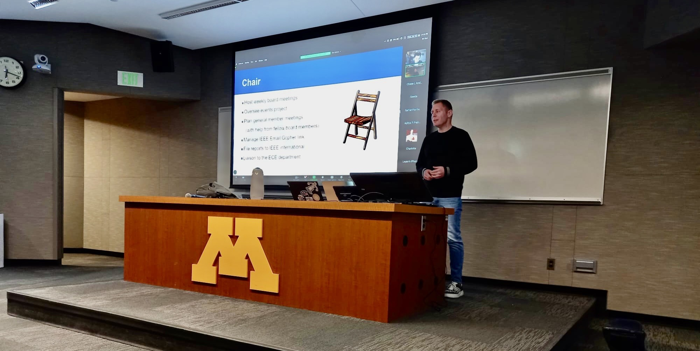

  
   

**scburtelson/scburtelson** is a ✨ _special_ ✨ repository because its `README.md` (this file) appears on your GitHub profile.

- 👋🏼 Hi! I'm Soren Burtelson @scburtelson. I'm an interdisciplinary doctoral researcher at DePaul University working on virtual reality (VR) systems for history pedagogy and immersive archival engagement. 
- 🔭 My academic background is in computer science & engineering and history. My technical focus has been in systems security, computer vision, and networks. My research in history has focused on United States social and political history from 1960 to 1975. 
- 🌱 As an interdisciplinary graduate researcher, I am leading a small team of undergraduate and graduate student researchers. My work is pioneering virtuality XR (VR, AR, etc.) and gaming for archival engagement and history pedagogy.
- 👯 I’m looking to collaborate on ...
- 🤔 I’m looking for help with ...
- 💬 Ask me about the intersection of history and computer science
- 😄 Pronouns: He/Him/His
- ⚡ Fun fact: I come from several generations of engineers and technologists. My grandfather, Frederick Soren Burtelson, was a telecommunications engineer for AT&T and Illinois Bell. His early invention was the green, metal boxes for connecting underground telephone cables (you've seen them along the road). My uncle, Fred W. Burtelson, began his career designing the oxygen systems for the original McDonnell Douglas Space Shuttle prototypes.
- 📫 How to reach me: z.umn.edu/SCB-LinkedIn
